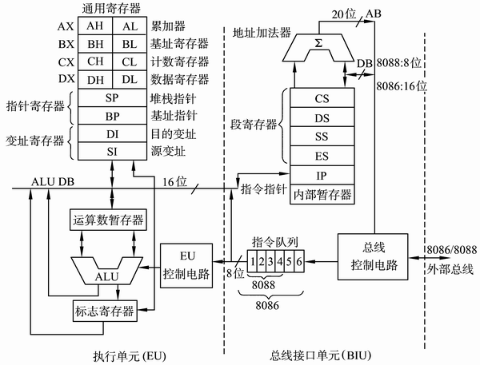

# 8086 机器

## 基本设定

结构图（非常重要）

机器字长: 16 位 (ALU，寄存器等的位宽)

地址线宽: 20 位（寻址空间为 1MB）

数据总线: 16 位 (8086), 8 位 (8088)

## **寄存器**（非常重要）

- 通用寄存器: 共 4 个，每个寄存器 16 位 (`*X`)，分为两个 8 位 (`*H`, `*L`)
  - `AX (AH, AL)` : 累加器 (**A**dd)
  - `BX (BH, BL)` : 基址寄存器 (**B**ase)
  - `CX (CH, CL)` : 计数寄存器 (**C**ount)
  - `DX (DH, DL)` : 数据寄存器 (**D**ata)
- 指针寄存器: 2 个
  - `SP`: 16 位堆栈指针
  - `BP`: 16 位基址指针 <!-- 参数指针 -->
- 变址寄存器 (字符串指针)
  - `SI`: 源串 (**S**ource)
  - `DI`: 目的串 (**D**estination)
- 段寄存器: 4 个
  - `CS`: 代码段 (**C**ode)
  - `DS`: 数据段 (**D**ata)
  - `SS`: 堆栈段 (**S**tack)
  - `ES`: 附加段 (**E**xtra)
- 指令指针
  - `IP`, 相当于 RISC 中的 `PC`
- 标志寄存器 `PSW`

`SS:SP` 组成堆栈 (`SS` 是堆栈基地址, `SP` 是栈顶相对基地址的偏移)

`CS:IP` 组成当前可执行点 (`CS` 是代码段基地址, `IP` 是当前指令相对基地址的偏移)

## 标志寄存器

     15 14 13 12 11 10  9  8  7  6  5  4  3  2  1  0
    +--+--+--+--+--+--+--+--+--+--+--+--+--+--+--+--+
    |  |  |  |  |OF|DF|IF|TF|SF|ZF|  |AF|  |PF|  |CF|
    +--+--+--+--+--+--+--+--+--+--+--+--+--+--+--+--+

标志含义:

- `OF` 溢出标志
- `DF` 方向标志 (地址递增/递减)
- `IF` 中断标志
- `TF` 陷阱标志
- `SF` 符号标志
- `ZF` 结果为零标志
- `AF` 辅助进位标志
- `PF` 奇偶标志
- `CF` 进位标志

## 存储器

8086 地址线共有 20 位，可寻址空间为 1MB。

### 总体结构

    +------------+ ---    ---    ---
    |   00000h   |  | Byte |      |
    +------------+ ---     | Word |
    |   00001h   |         |      |
    +------------+        ---     | DoubleWord
    |   00002h   |                |
    +------------+                |
    |   00003h   |                |
    +------------+               ---
    |            |
    |   ......   |
    |            |
    +------------+
    |   FFFFFh   | 1MB
    +------------+

内存的基本单元为一个**字节** (Byte, 8 位)，按线性顺序存放；两个字节组合为一个**字** (Word, 16 位)，两个字组合成为一个**双字** (Double Word, 32 位)。

内存中可以任意组合存放字节、字、双字，**无需字对齐** (与 MIPS 不同)。

在内存中存放一个字时，低字节在前，高字节在后; 存放双字时，低字在前，高字在后（即: 按字节小端序存储）

例: 在 `00000h` 地址存放一个双字 `12345678h`

      addr : data
    00000h : 78h
    00001h : 56h
    00002h : 34h
    00003h : 12h

### 字节、字、双字的存取

例题: `CL` 中有字节 `'A'`, `BX` 中有字 `2000h`, `DX:AX` 中有双字 `12345678h`。

- 依次将 `CL`, `BX`, `DX:AX` 中的内容按照字节、字、双字的结构存入地址 `30000h` 处。

        addr : data
      30000h : 41h     ; 'A'
      30001h : 00h     ; 2000h
      30002h : 20h     ; 
      30003h : 78h     ; 12345678h
      30004h : 56h     ;
      30005h : 34h     ;
      30006h : 12h     ;

- 将内存 `30000h` 处的一个字取出来送入 `BX` 中，将 `30002` 处的一个双字送入 `DX:AX` 中

      BX = 0041h [BH = 00h, BL = 41h]
      DX = 3456h [DH = 34h, DL = 56h]
      AX = 7820h [AH = 78h, AL = 20h]
      DX:AX = 34567820h

### 逻辑地址和物理地址

用 16 位的地址寄存器来表示地址，最多可寻址 64KB 空间。要表示 20 位地址，需要对内存进行**分段**，用一个寄存器 (段寄存器) 表示段地址，用另一个寄存器 (指针寄存器) 表示段内地址偏移。

将 1MB 内存分段，每段最大 64KB。

- 物理地址: 20 位二进制，与内存单元 (字节) 一一对应
- 逻辑地址: 用**段地址**和**偏移值**组合表示内存地址, 常写作 `段地址:偏移值` 的形式
- 物理地址 = 段地址 x 16D(10h) + 偏移地址，一个物理地址可能有多个逻辑地址的组合。
- 典型的程序在内存中执行时，一般都有**代码段**，**数据段**，**堆栈段**，其段地址分别用 `CS`, `DS`, `SS` 来存放。

### 堆栈的组成和操作

堆栈: 由 `SS` 和 `SP` 确定的一块特殊区域，严格按照**先进后出**的方式工作。增长方向为从高地址向低地址（与 MIPS 相似）

例: `SS = 2000h, SP = 0100h`

- 堆栈区域为 `2000h:0000h` 至 `2000h:00FFh`
- 栈顶指针值为 `0100h` （注意栈顶指针值本身不属于堆栈）
- 压栈操作 `PUSH op`
  1. `SP = SP - 2`
  2. `op -> SS:[SP]`
- 出栈操作 `POP op`
  1. `op <- SS:[SP]`
  2. `SP = SP + 2`
